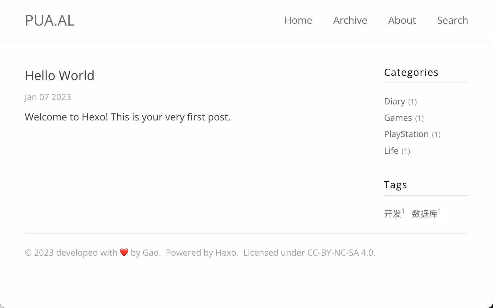

# hexo-theme-mnh

[中文文档](README_zh.md)

A simple theme for Hexo. Based on [hexo-theme-polarbearsimple](https://github.com/henryhuang/hexo-theme-polarbearsimple)



[Online Demo](https://pua.al)

## Installation

1.Install Hexo plugin `hexo-renderer-sass` `hexo-renderer-swig` `hexo-generator-archive` and `hexo-algoliasearch`

  ```bash
  npm install hexo-renderer-scss@github:meannoharm/hexo-renderer-sass hexo-renderer-swig hexo-generator-archive hexo-algoliasearch --save
  ```
  
  if use `nodejs` version > 12, `hexo-renderer-sass` may installed incorrect, see [Issue](https://github.com/knksmith57/hexo-renderer-sass/issues/43) and [Pull request](https://github.com/knksmith57/hexo-renderer-sass/pull/46).

  You can run this command to install `hexo-renderer-sass` from [@kmuncie](https://github.com/kmuncie)

  ```bash
  npm install --save https://github.com/kmuncie/hexo-renderer-sass
  ```

2.Download the theme to your Hexo theme folder

  ```bash
  git clone https://github.com/meannoharm/hexo-theme-mnh themes/mnh
  ```

3.Modify `your_site/_config.yml`

```yaml
# Extensions
## Plugins: http://hexo.io/plugins/
## Themes: http://hexo.io/themes/
theme: mnh

# Show all articles at archive page.
# Need to install hexo-generator-archive
archive_generator:
    per_page: 0
    yearly: false
    monthly: false
    daily: false

# Global search based on Algolia https://www.algolia.com/
# Need to install and config hexo-algoliasearch
algolia:
  applicationID: "<APP_ID>"
  apiKey: "<API_KEY>"
  adminApiKey: "<ADMIN_API_KEY>"
  chunkSize: 5000
  indexName: "<INDEX_NAME>"
  fields:
  - content:strip:truncate,0,500
  - excerpt:strip
  - permalink
  - cover
  - slug
  - tags
  - categories
  - title
```

## Theme Config

Modify `your_site/themes/mnh/_config.yml`

### Widget Function

```yaml
# widget function
# false: disable
# widget_custom: custom your widget
#   title: your widget title
#   content: Add your html code in here. Example: <p>testing...</p>
widget:
  Tags: true
  Categories: false
  Custom: false

widget_custom:
    title: Test
    content: <p>testing...</p>
```

### Site Analytics

```yaml
# Baidu Analytics
baidu_analytics:
  enable: true
  key: "[BAIDU ANALYTICS KEY]"
# Google Analytics
# use google analytics 4
google_analytics:
  enable: true
  gtag: "[GOOGLE ANALYTICS GTAG]"
```

### Comment Function

```yaml
# Duoshuo
duoshuo_shortname:
# Disqus
disqus_shortname:
# utterances
utterances:
  enable: true
  repo: "[ENTER REPO HERE]"
  issueTerm: pathname
  theme: github-light
```

### License Config

```yaml
license:
  name: CC-BY-NC-SA 4.0
  link: https://creativecommons.org/licenses/by-nc-sa/4.0/
```
